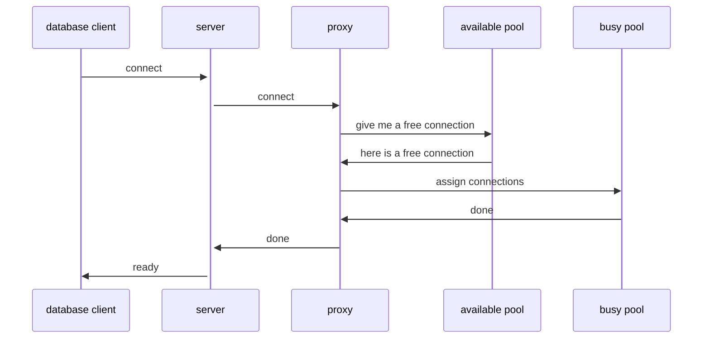
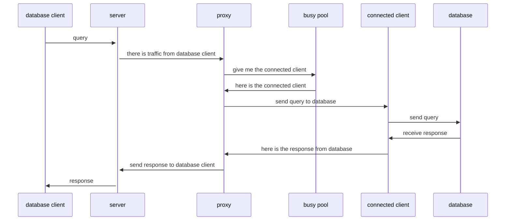
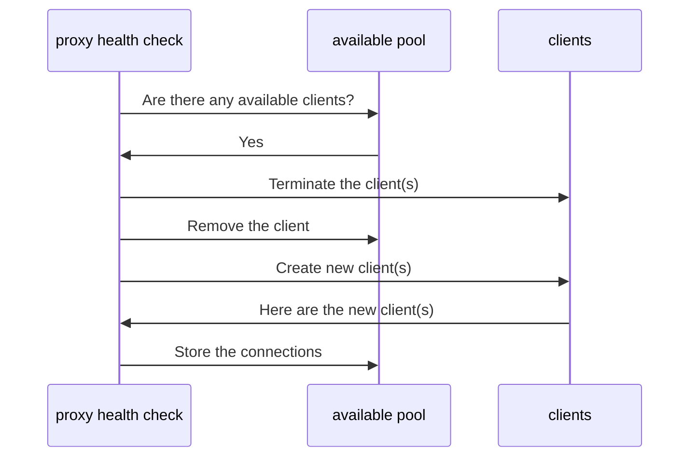

# Proxies

Proxy object is used to create a binding between incoming connections from the database clients to the database servers. Each incoming connection will connect to the [server](servers). Upon connection, the server object instructs the [proxy](proxies) object to assign an available [client](clients) object from the [pool](pools). If no client object is available, the proxy object will reject the incoming connection with an error.

If any traffic comes from the incoming connection, it will be forwarded to the server. It will wait for the server to respond and forward the response back to the incoming connection. The proxy object will also handle the connection health check and the connection timeout.

## Proxy object

The following sequence diagram shows how the proxy object works.

{: .note }
> Both the available pool and the busy pool are created and managed by the proxy object.

## Traffic handling

The following sequence diagram shows how the proxy object handles the traffic.

## Connection health check

The proxy object will periodically check the connection health by disconnecting stale connections the database server and creating the same number of new connections to the database server. The following sequence diagram shows how the proxy object handles the connection health check. Stale connections are connections that have not been used for a long time and are considered unhealthy.

