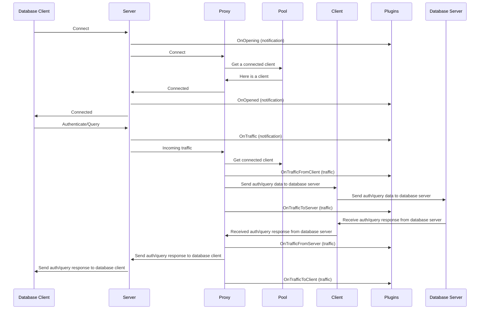

# Connection Lifecycle

The connection lifecycle is the process of establishing a connection between a client and a server. This process is initiated by the client and is completed when the client disconnects from the server. In doing so, the client and server exchange data, in the form of queries and responses, which are sent over the connection and processed by the GatewayD and its plugins.

The connection lifecycle is composed of the following steps:

1. GatewayD starts with a pool of client connections to database server.
2. The database client initiates a connection to the GatewayD.
3. GatewayD accepts the connection and assigns it to a client connection.
4. The client sends a query to the GatewayD.
5. GatewayD proxies (forwards) the query to the database server.
6. GatewayD receives the response from the database server.
7. GatewayD sends the response to the client.
8. Database client disconnects from GatewayD.
9. The client connection closes and a new client connection is created.
10. The new client connection is added to the pool of client connections.
11. The process repeats from step 2.

The above steps are partially illustrated in [traffic handling diagram](06-proxies.md#traffic-handling) of the proxies page.

## Plugin hooks
<!-- Move to the plugins section -->

Plugins can be used to modify the connection lifecycle. Each step in the connection lifecycle is represented by one or more plugin hook(s). Plugins can register themselves to be called when a specific hook is triggered. The following table lists the available hooks and the corresponding plugin hook(s).

| Hook                  | Type         | Description                                                                                                                                                                                                            |
| --------------------- | ------------ | ---------------------------------------------------------------------------------------------------------------------------------------------------------------------------------------------------------------------- |
| `onConfigLoaded`      | Config       | Called when the GatewayD configuration is loaded. Can change the global configuration.                                                                                                                                 |
| `onNewLogger`         | Notification | Called when a new logger is created.                                                                                                                                                                                   |
| `onNewPool`           | Notification | Called when a new pool is created.                                                                                                                                                                                     |
| `onNewClient`         | Notification | Called when a new client is created.                                                                                                                                                                                   |
| `onNewProxy`          | Notification | Called when a new proxy is created.                                                                                                                                                                                    |
| `onNewServer`         | Notification | Called when a new server is created.                                                                                                                                                                                   |
| `onSignal`            | Notification | Called when an OS signal is received.                                                                                                                                                                                  |
| `onRun`               | Notification | Called when the GatewayD is started.                                                                                                                                                                                   |
| `onBooting`           | Notification | Called when the GatewayD is booting.                                                                                                                                                                                   |
| `onBooted`            | Notification | Called when the GatewayD is booted.                                                                                                                                                                                    |
| `onOpening`           | Notification | Called when a new connection is being opened by a database client. This happens before the proxy connects the incoming connection to a client in the pool.                                                             |
| `onOpened`            | Notification | Called when a new connection is opened by a database client. This happens after the proxy connects the incoming connection to a client in the pool.                                                                    |
| `onClosing`           | Notification | Called when a connection is being closed by a database client. This happens before the proxy disconnects the client from the pool.                                                                                     |
| `onClosed`            | Notification | Called when a connection is closed by a database client. This happens after the proxy disconnects the client from the pool.                                                                                            |
| `onTraffic`           | Notification | Called when traffic is received from a database client.                                                                                                                                                                |
| `onTrafficFromClient` | Traffic      | Called when traffic is received from a database client, aka. the request. Plugins can terminate the connection and return a response or an error. They can also modify the request before it is proxied to the server. |
| `onTrafficToServer`   | Traffic      | Called when traffic is sent to a database server. Plugins will receive a copy of the request sent to the server.                                                                                                       |
| `onTrafficFromServer` | Traffic      | Called when traffic is received from a database server, aka. the response. Plugins can also modify the response before it is sent to the client. Plugins receive a copy of the request as well as the response.        |
| `onTrafficToClient`   | Traffic      | Called when traffic is sent to a database client.  Plugins receive a copy of the request as well as the response.                                                                                                      |
| `onShutdown`          | Notification | Called when the GatewayD is shutting down.                                                                                                                                                                             |
| `onTick`              | Notification | Called on intervals set in the global configuration of the server object.                                                                                                                                              |
| `onHook`              | Notification | Called when a custom hook is triggered. This is reserved for future uses in GatewayD.                                                                                                                                  |

## Connection lifecycle diagram

