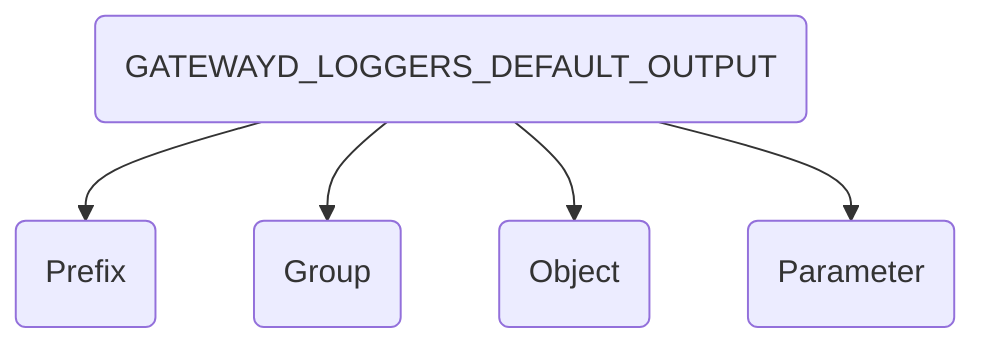

# Configuration

GatewayD is fully configurable via various sources, including default values, YAML config files, environment variables, CLI flags and plugins. This is the order in which the config parameters are applied. Plugins override the global configs and has the highest precedence overall, which means the plugin default values have the lowest precedence.

1. Plugin default values. ⬇️
2. Plugin config file: `gatewayd_plugins.yaml`.
3. Environment variables for plugins.
4. Global default values.
5. Global config file: `gatewayd.yaml`.
6. Environment variables for global config.
7. Global config updated by plugins via the `OnConfigLoaded` hooks. ⬆️

## Global configuration

Global configuration contains all the config parameters for managing a running GatewayD instance. It includes parameters for configuring:

- [Loggers](01-configuration/01-global-configuration/01-loggers.md)
- [Metrics](01-configuration/01-global-configuration/02-metrics.md)
- [Clients](01-configuration/01-global-configuration/03-clients.md)
- [Pools](01-configuration/01-global-configuration/04-pools.md)
- [Proxies](01-configuration/01-global-configuration/05-proxies.md)
- [Servers](01-configuration/01-global-configuration/06-servers.md)
- [API](01-configuration/01-global-configuration/07-api.md)

This is the complete global config file with the default values:

```yaml
# ⬇️ Configuration file

loggers: # ⬅️ Configuration object
  default: # ⬅️ Configuration group
    # Configuration parameters ⬇️
    output: ["console"] # "stdout", "stderr", "syslog", "rsyslog" and "file"
    level: "info" # panic, fatal, error, warn, info (default), debug, trace
    noColor: False
    timeFormat: "unix" # unixms, unixmicro and unixnano
    consoleTimeFormat: "RFC3339" # Go time format string
    # If output is file, the following fields are used.
    fileName: "gatewayd.log"
    maxSize: 500 # MB
    maxBackups: 5
    maxAge: 30 # days
    compress: True
    localTime: False
    # Rsyslog config
    rsyslogNetwork: "tcp"
    rsyslogAddress: "localhost:514"
    syslogPriority: "info" # emerg, alert, crit, err, warning, notice, debug

metrics:
  default:
    enabled: True
    address: localhost:2112
    path: /metrics

clients:
  default:
    network: tcp
    address: localhost:5432
    tcpKeepAlive: False
    tcpKeepAlivePeriod: 30s # duration
    receiveChunkSize: 8192
    receiveDeadline: 0s # duration, 0ms/0s means no deadline
    sendDeadline: 0s # duration, 0ms/0s means no deadline

pools:
  default:
    size: 10

proxies:
  default:
    elastic: False
    reuseElasticClients: False
    healthCheckPeriod: 60s # duration

servers:
  default:
    network: tcp
    address: 0.0.0.0:15432
    softLimit: 0
    hardLimit: 0
    enableTicker: False
    tickInterval: 5s # duration
    multiCore: True
    lockOSThread: False
    loadBalancer: roundrobin
    readBufferCap: 134217728
    writeBufferCap: 134217728
    socketRecvBuffer: 134217728
    socketSendBuffer: 134217728
    reuseAddress: True
    reusePort: True
    tcpKeepAlive: 3s # duration
    tcpNoDelay: True

api:
  enabled: True
  httpAddress: localhost:18080
  grpcNetwork: tcp
  grpcAddress: localhost:19090
```

## Plugins configuration

GatewayD supports plugins. Plugins configuration is called `gatewayd_plugins.yaml`, which contains both the general configurations that manage plugins and the configuration of plugins themselves, which are explained in the following pages:

- [General configuration](01-configuration/02-plugins-configuration/01-general-configurations.md)
- [Plugins configuration](01-configuration/02-plugins-configuration/02-plugins-configuration.md)

This is the complete plugins config file with the default values and an example plugin:

```yaml
verificationPolicy: "passdown"
compatibilityPolicy: "strict"
acceptancePolicy: "accept"
enableMetricsMerger: True
metricsMergerPeriod: 5s
healthCheckPeriod: 5s
reloadOnCrash: True
timeout: 30s
plugins:
  - name: gatewayd-plugin-cache
    enabled: True
    localPath: ../gatewayd-plugin-cache/gatewayd-plugin-cache
    args: ["--log-level", "debug"]
    env:
      - MAGIC_COOKIE_KEY=GATEWAYD_PLUGIN
      - MAGIC_COOKIE_VALUE=5712b87aa5d7e9f9e9ab643e6603181c5b796015cb1c09d6f5ada882bf2a1872
      - REDIS_URL=redis://localhost:6379/0
      - EXPIRY=1h
      # - DEFAULT_DB_NAME=postgres
      - METRICS_ENABLED=True
      - METRICS_UNIX_DOMAIN_SOCKET=/tmp/gatewayd-plugin-cache.sock
      - METRICS_PATH=/metrics
      - PERIODIC_INVALIDATOR_ENABLED=True
      - PERIODIC_INVALIDATOR_INTERVAL=1m
      - PERIODIC_INVALIDATOR_START_DELAY=1m
      - API_ADDRESS=localhost:18080
    checksum: 28456728dd3427b91d2e22f38b909526355d1b2becc9379581e1b70bb9495aa9
```

## Environment variables

All configuration parameters have a corresponding environment variables, except in certain cases. All environment variables are prefixed with `GATEWAYD` and are in snake case. For example, the `GATEWAYD_LOGGERS_DEFAULT_OUTPUT` environment variable can be set to the outputs required by the default logger and consists of four parts:

1. Prefix: all environment variables are prefixed with `GATEWAYD`.
2. Group: the configuration group, in this case `DEFAULT`.
3. Object: the configuration object, in this case `LOGGERS`.
4. Parameter: the configuration parameter, in this case `OUTPUT`.



## Runtime configuration

GatewayD allows plugins to update the global configuration at runtime. This is done by calling the `OnConfigLoaded` hook, which is called after the global configuration is loaded. The `OnConfigLoaded` hook is called on startup with the global configuration as a parameter. The plugin can then modify the global configuration and return it. The modified global configuration will be used by GatewayD.

An example of this update can be found in the [Go plugin template](https://github.com/gatewayd-io/plugin-template-go/blob/981b36aa62b4ba059656c6dde08f67a9206c0948/plugin/plugin.go#L54-L129). The following snippet shows how to update the global configuration at runtime:

```go
func (p *Plugin) OnConfigLoaded(
  ctx context.Context,
  req *structpb.Struct
) (*structpb.Struct, error) {
  if req.Fields == nil {
    req.Fields = make(map[string]*structpb.Value)
  }
  req.Fields["loggers.default.level"] = &structpb.Value{
    Kind: &structpb.Value_StringValue{
      StringValue: "debug",
    },
  }
  req.Fields["loggers.default.noColor"] = &structpb.Value{
    Kind: &structpb.Value_BoolValue{
      BoolValue: false,
    },
  }

  return req, nil
}
```
