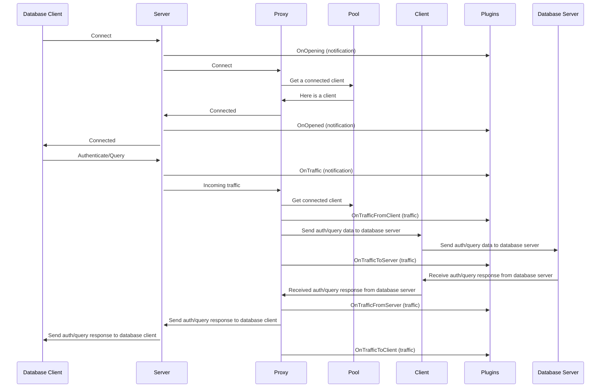

# Connection Lifecycle

The connection lifecycle is the process of establishing a connection between a client and a server. This process is initiated by the client and is completed when the client disconnects from the server. In doing so, the client and server exchange data, in the form of queries and responses, which are sent over the connection and processed by the GatewayD and its plugins.

The connection lifecycle is composed of the following steps:

1. GatewayD starts with a pool of client connections to database server.
2. The database client initiates a connection to the GatewayD.
3. GatewayD accepts the connection and assigns it to a client connection.
4. The client sends a query to the GatewayD.
5. GatewayD proxies (forwards) the query to the database server.
6. GatewayD receives the response from the database server.
7. GatewayD sends the response to the client.
8. Database client disconnects from GatewayD.
9. The client connection closes and a new client connection is created.
10. The new client connection is added to the pool of client connections.
11. The process repeats from step 2.

The above steps are partially illustrated in [traffic handling diagram](/using-gatewayd/proxies#traffic-handling) of the proxies page.

## Connection lifecycle diagram

