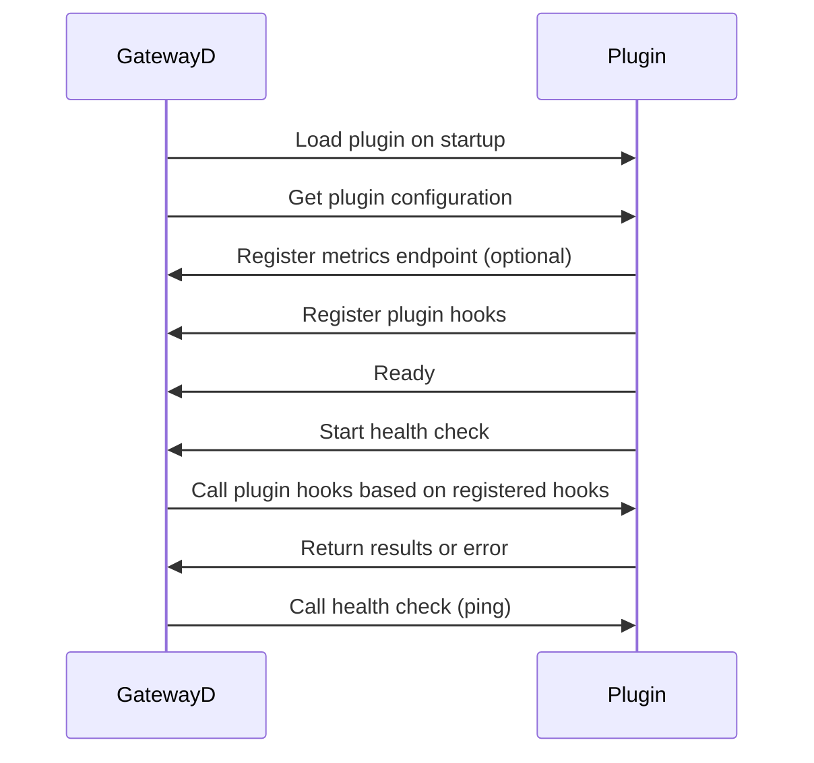

# Plugins

Plugins play a very important role in GatewayD for adding support for different databases. They are the building blocks of GatewayD, and they are responsible for the majority of the functionality of GatewayD. GatewayD itself does not contain any database specific code, and instead relies on plugins to add support for different databases. GatewayD passes traffic as binary to the plugin, and the plugin is responsible for parsing the binary data and performing the necessary actions.

Plugins are normal executables that are loaded by GatewayD at startup. GatewayD talk to plugins over [gRPC](https://grpc.io/) with [protocol buffers](https://protobuf.dev/), and GatewayD passes the binary data to the plugin. The plugin is responsible for parsing the binary data and performing the necessary actions. The plugin then returns the result to GatewayD, which passes it back to the client.

They are responsible for the following:

- Sending/receiving the protocol-specific data from the client and server
- Parsing the protocol-specific data
- Extracting information from the protocol-specific data
- Performing actions based on the extracted information
- Parsing SQL queries from the client
- Parsing responses from the server

For example, the [gatewayd-plugin-cache](/plugins/gatewayd-plugin-cache) decodes the [PostgreSQL wire protocol](/miscellaneous/glossary#postgresql-wire-protocol), extracts the SQL select query from the client, and then caches the result of the query in Redis. The next time the same select query is sent, the plugin will return the cached result instead of sending the query to the server. It also checks if the query is an upsert, delete, alter or drop query, and it will invalidate the cache based on the table in the query. This is a very simple example of what a plugin can do.

Plugins are generally written in Go, but can be written in any other language, and are compiled into a stand-alone executable file to be run by GatewayD. The executable is then loaded by GatewayD at startup.

## Configuration

For more information on how to configure plugins, see [general configuration](/using-gatewayd/plugins-configuration/general-configurations) of the plugins and the [plugins configuration](/using-gatewayd/plugins-configuration/plugins-configuration).

## Lifecycle

Plugins are loaded on startup. They are present during the entire lifetime of GatewayD, and will be reloaded if they crash. Crash detection is done by the health check, which is described in more detail below. Metrics are merged from all plugins, and are exposed on the [`https://localhost:9090/metrics`](https://localhost:9090/metrics) endpoint by GatewayD. The rest of the functionality is described in more detail below.

## Priority

Plugins are loaded in the order in which they appear in the [plugins configuration](/using-gatewayd/plugins-configuration/plugins-configuration). The first plugin in the list will be called first, and the last plugin in the list will be called last. The result of the plugin hooks are merged together. If any of the plugins return an error, the error is returned to GatewayD and further to the client.

## Signals

A signal is a message that is sent to the policy engine to trigger the evaluation of the policies. The signals are generated by the plugins and are sent to the [policy engine](../using-gatewayd/Act.md) for evaluation. The signals can be of different types, such as `terminate`, `log`, etc., and can contain different types of data, such as the log message and log level, and whether the signal is enabled or not. A signal consists of two fields:

1. `name`: The name of the signal, such as `terminate`, `log`, etc.
2. `metadata`: The metadata associated with the signal, such as the log message and log level.

For more information about signals, see the [Act](../using-gatewayd/Act.md) documentation.

## Policies

Certain policies can be applied to plugins. These policies are applied to all plugins, and can be configured in the [general configuration](/using-gatewayd/plugins-configuration/general-configurations) of the plugins configuration file.

### Compatibility policy

The compatibility policy controls how GatewayD treats plugins' requirements. If a plugin requires a specific version of another plugin, the compatibility policy controls whether to allow or reject the plugin.

- `strict` (default): the plugin is rejected if it requires a specific version of another plugin and that version is not the one currently loaded.
- `loose`: the plugin is allowed to run even if it requires a specific version of another plugin and that version is not the one currently loaded.

## Health check

Plugins are monitored by GatewayD, and if they crash, GatewayD will reload them. The health check is done by sending a ping to the plugin, and if the plugin does not respond within the timeout, GatewayD will reload the plugin. The `healthCheckPeriod` is configurable in the [general configuration](/using-gatewayd/plugins-configuration/general-configurations) of the plugins configuration file.

### Reload on crash

If a plugin crashes, GatewayD will reload it by the next health check if `reloadOnCrash` is enabled (default) in the [general configuration](/using-gatewayd/plugins-configuration/general-configurations) of the plugins configuration file.

## Timeout

Plugin hooks have a timeout, which is configurable in the [general configuration](/using-gatewayd/plugins-configuration/general-configurations) of the plugins configuration file. If the plugin does not respond within the timeout, GatewayD will log the error and continue with the next plugin or continue processing if it is the last plugin.

## Start timeout

Plugins have a start timeout, which is configurable in the [general configuration](/using-gatewayd/plugins-configuration/general-configurations) of the plugins configuration file. If the plugin does not start within the timeout, GatewayD will log the error and continue with the next plugin or continue processing if it is the last plugin.

## Metrics merger

Plugins can choose to expose Prometheus metrics, either separately or together with GatewayD. If a plugin exposes metrics over [Unix Domain Socket](https://en.wikipedia.org/wiki/Unix_domain_socket), they are collected, relabeled and merged with metrics of GatewayD and exposed on the [`https://localhost:9090/metrics`](https://localhost:9090/metrics) endpoint. The metrics merger is configurable in the [general configuration](/using-gatewayd/plugins-configuration/general-configurations) of the plugins configuration file. If the metrics merger is disabled, the metrics won't be merged.

If a plugin developer chooses to expose metrics over HTTP, they can be scraped by Prometheus, but they won't be merged with metrics of GatewayD.

## Command-line arguments

Sine plugins are stand-alone executables, GatewayD can pass command line arguments to them. The command-line arguments are configurable in the [plugins configuration](/using-gatewayd/plugins-configuration/plugins-configuration). The command-line arguments are passed to as an array of strings, and are passed to the plugin as is.<!-- Plugin developers can choose to parse the command-line arguments or not using the [flag package](https://golang.org/pkg/flag/).-->

## Environment variables

GatewayD can pass environment variables to plugins. The environment variables are configurable in the [plugins configuration](/using-gatewayd/plugins-configuration/plugins-configuration). The environment variables are passed to as an array of strings, and are passed to the plugin as is.<!-- Plugin developers can choose to parse the environment variables or not using the [os package](https://golang.org/pkg/os/).-->

## Checksum verification

Plugins can be verified by their checksum, which is a SHA256 checksum of the plugin's executable file. The checksum is configurable in the [plugins configuration](/using-gatewayd/plugins-configuration/plugins-configuration). The checksum is verified before the plugin is loaded. If the checksum verification fails, GatewayD will not load the plugin. For now, the checksum should be manually copied from the plugin's archive that is downloaded from the plugin's repository into the [plugins configuration](/using-gatewayd/plugins-configuration/plugins-configuration).

{: .wip }
> We have plans to automate the [checksum verification process](https://github.com/gatewayd-io/gatewayd/issues/78), so that the checksum is [automatically fetched](https://github.com/gatewayd-io/gatewayd/issues/122) from the plugin's repository and verified before the plugin is loaded.

## Plugin naming convention

Plugin names usually follow the format `gatewayd-plugin-<plugin-name>`. For example, the [gatewayd-plugin-cache](/plugins/gatewayd-plugin-cache), but the community can choose to use any name they want. The plugin name is used to identify the plugin, and it is also used to identify the plugin's version. The plugin name is configurable in the [plugins configuration](/using-gatewayd/plugins-configuration/plugins-configuration).

We recommend that plugin developers use unique names with the `gatewayd-plugin-` prefix to avoid naming conflicts with other plugins.
